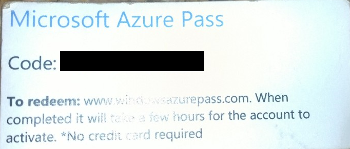
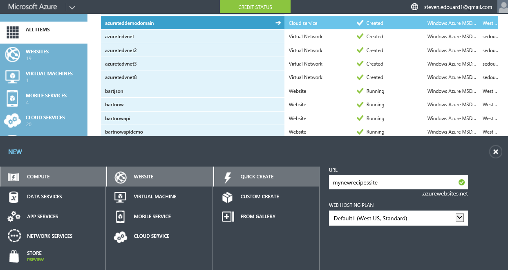
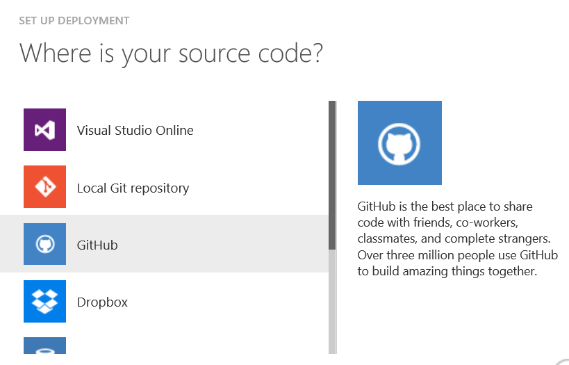
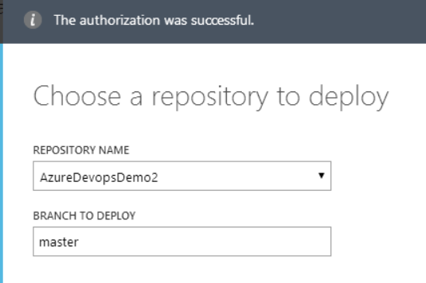
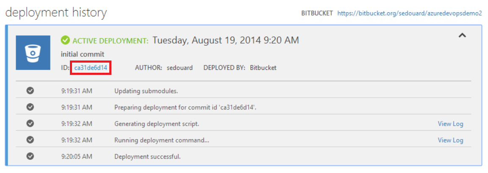

# Building Your Resume Like a Bauss with CI

[BuildStatus](https://travis-ci.org/sedouard/resume.svg?branch=master)

## Introduction

If you're a developer geek like I am, you'll want to check this out. This repository builds my resume using continuous integration deployment using git. Seriously! You can find the live resume **[here](http://sedouard-resume.azurewebsites.net)**.

What other way can you show you know the agile development lifecycle by expressing it through your resume itself. It's just a few easy steps.

Here you'll find all you need to deploy and create your own resume. We are using the nifty [resume-cli](https://www.npmjs.org/package/resume-cli) command line tool to compile our resume from a JSON schema into HTML and even PDF. This guide will walk through how to use Continuous Integration to validate and git deploy your resume!

## Getting Setup

You're going to want to first **fork** this repository. Then install the resume command line interface (cli) globally:

(hint: make sure you have **[nodejs](http://nodejs.org)** installed first!!)

```bash
# You may have to do sudo npm install depending on your system
npm install resume-cli -g

```

Now, cd to this repository install the required packages


```bash
cd ./path-to-your-local-repo
npm install

```

## The Resume.json file

This [resume.json](./resume.json) file contains all the data in your resume. You can modify my own or create your own by doing:

```bash
resume init
```
The schema is pretty clear, just put in the links and data where appropriate:

```json
{
  "basics": {
    "name": "Steven Edouard",
    "label": "Developer Evangelist",
    "picture": "https://scontent-b-sjc.xx.fbcdn.net/hphotos-prn1/t1.0-9/603953_10151522578258327_946466229_n.jpg",
    "email": "steven.edouard1@gmail.com",
    "website": "http://stevenedouard.com",
    "summary": "I'm a Developer Evangelist for Microsoft. Every day I work to empower individuals to build awesome things. I eventually hope to persue a role where I can have high impact on a product.",
    "location": {
      "city": "San Francisco",
      "countryCode": "US",
      "region": "California"
    },
    "profiles": [
      {
        "network": "Twitter",
        "username": "sedouard",
        "url": "http://twitter.com/sedouard"
      },
      {
```
The above json is truncated, checkout **[resume.json](./resume.json)** for the full thing.

## Deploying to Your Own Website

To git deploy to an Azure website you'll need to have an Azure subscription.

Get an Azure Account by either getting a [free trial](http://azure.microsoft.com/en-us/pricing/free-trial/), or a token from me, @sedouard which looks like this:



If you're working on a Startup signup for [Bizspark](http//bizspark.com) or tweet at me [@sedouard](http://twitter.com/sedouard] with your plan and I'll get you a bizspark token for free Azure usage for 3 years.


After you get your subscription create a new website:




Now you can link your repository to a source control provider. In the site dashboard click **Setup deployment from source control**:


Now just select **Github**. (The screenshot below shows BitBucket but it works the same with Github):



Select your **repository** and the **branch** you wisht to deploy. (You probably want to deploy master)



## Deploying your resume

Ensure that your resume looks the way you want by executing:

```bash

resume export index -f htm

  running validation tests on resume.json ...

  √ Passed all validation tests.
```

This command will be ran by the azure web site and will automatically publish your website to **<your site name>.azurewebsites.net**. You can buy a domain name for your resume from a domain name provider like **[namecheap](http://namecheap.com)** and setup a [custom domain name](http://azure.microsoft.com/en-us/documentation/articles/web-sites-custom-domain-name/) for your resume really easily too!


Now finally, to deploy your resume just do

```bash
# commit your changes in resume.json
git commit . -m 'updating resume'
git push origin master

```

Now almost immeditley you'll see Azure Websites go to work:



## The Deployment Files

**!!You don't have to read this part if you aren't interested in how the deployment works!!**

This repository contains a **.deployment** and **deploy.cmd** scripts which are specific deployment files for Azure websites. These files were generated with the azure command line interface. To create these files yourself do:

```bash
npm install azure-cli -g
azure site deploymentscript --basic --sitePath .
```

Then the deployment script was modified to run the locally install resume-cli node package. Here's what was added to **deploy.cmd**:

```batch
REM Use the Executecmd macro to execute and validate the command worked
echo Building Resume
call :Executecmd npm install
IF !ERRORLEVEL! NEQ 0 goto error
REM This creates the **index.html** which is deployed by Azure Websites.
call :Executecmd node .\node_modules\resume-cli\index.js export index -f html
IF !ERRORLEVEL! NEQ 0 goto error
```

Hope this guide inspires you to 'build' your own resume!
